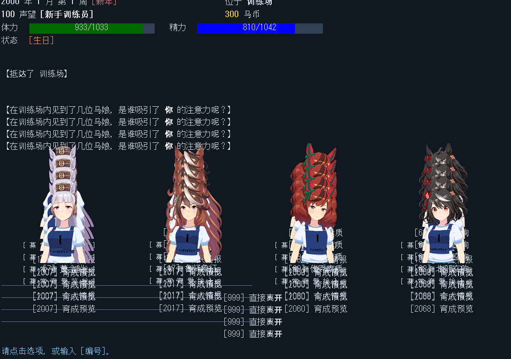
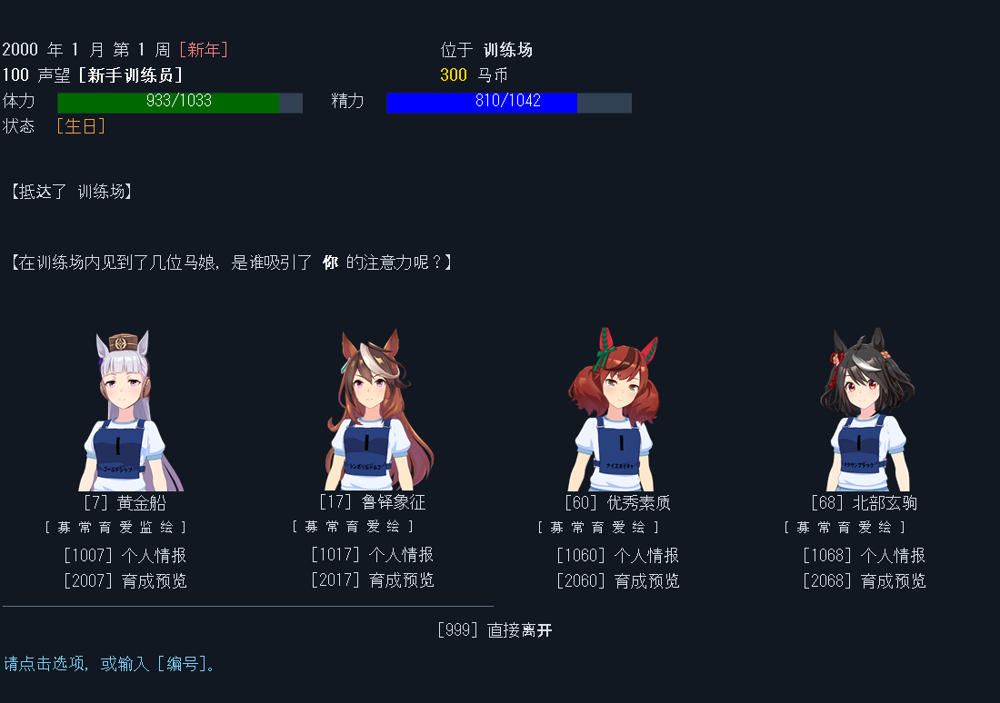

# 0.3.1 클릭·화면 중첩 수정 근거

2026-10-01. **0.3.0 사용자 직접 시험은 실패했다.** 빈 화면 클릭은 대사를 진행하지 못했고 선택 후 모집 화면의 이미지·메뉴가 겹쳤다. 사용자는 레이스 이전에 시험을 중단했다. 아래 결과는 이 결함의 수정 검사이며, 전체 직접 플레이 완료 판정이 아니다.

| 근거 | 확인 범위 |
|---|---|
| [input-echo.json](input-echo.json) | 원본 모집 함수와 시험 저장의 게임 상태로 실제 ERB INPUTS 3회를 처리. 이전 DLL은 추가 미관리 줄 [0,1,2,3], 수정 DLL은 [0,0,0,0]. 입력 출력은 양쪽 모두 [1,1,1]줄 |
| [continue-input.json](continue-input.json) | 일반 Game.ERB 입력 루프를 사용. 이전 INPUTS 빈 클릭 차단 대조, WAIT 빈 클릭, TWAIT 시간 초과 뒤 빈 클릭, 번호 선택·문자열·URL 값 입력 유지 |
| [host-regression.json](host-regression.json), [ui-host.json](ui-host.json) | 기본 10·API 21·저장 10·선정 플레이 46·UI 21 자동 검사 |
| [native-regression.json](native-regression.json), [game-ui-res.json](game-ui-res.json) | 정확한 배포 실행기 7단계와 원본 23개 canvas 출력 재검사 |
| [binaries.json](binaries.json) | 수정 DLL·입력 코드·배포 실행기의 SHA256 |

격리한 시험 프로세스 내부에서 EmueraConsole의 입력 처리와 MainWindow의 클릭 처리 메서드를 검사했다. OS 입력·사람의 직접 클릭·Windows 화면 캡처는 아니다. PNG는 실행기의 자체 OnPaint canvas다. 사용자 저장과 원시 시험 저장은 포함하지 않는다.

실제 대조 이미지(숫자 입력 3회 후):

수정 전 0.3.0:

수정 후 0.3.1:

수정 후 사람이 수행하는 레이스→결과→저장→완전 종료→재실행→로드→후속 행동과 실제 음향 청취는 미확인이다. [기능별 상태](../../ERAUMA_UI_STATUS.md)와 [직접 시험 기록](../../ERAUMA_SECOND_WORK_ORDER.md)을 함께 참조한다. [0.3 자동 근거](../0.3/README.md)는 역사 기록이며 이번 사용자 실패를 발견하지 못했다.
