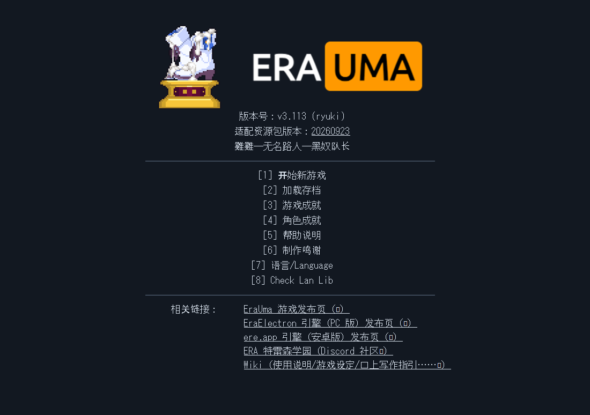
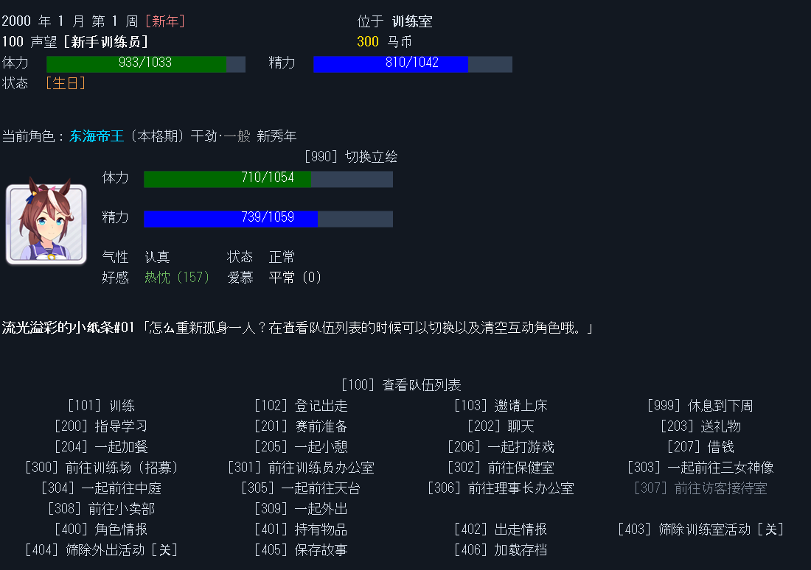
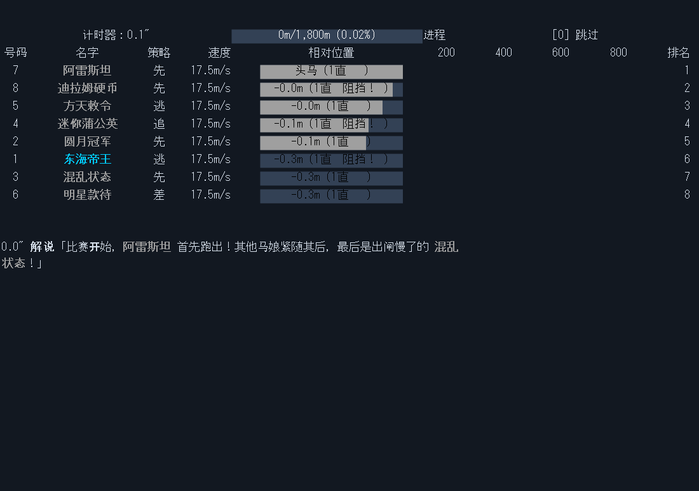
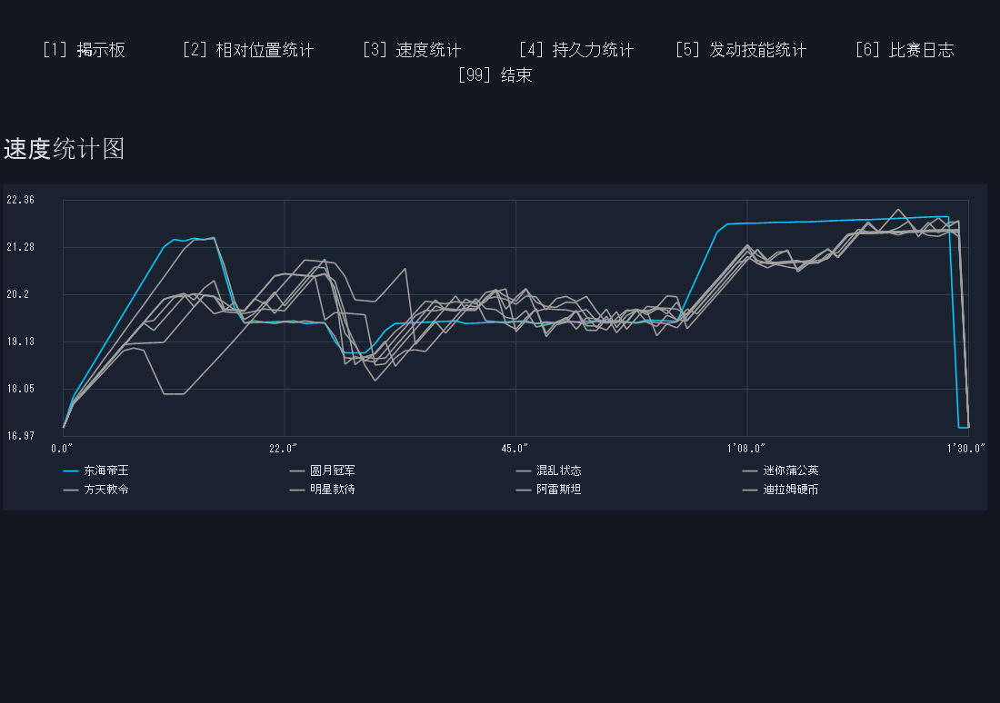

# 0.3 자동 검증 근거

2026-10-01의 2차 UI·리소스 재작업 결과다. **사람의 직접 플레이와 실제 음향 청취는 아직 미확인**이다. PNG는 정확한 배포 실행기의 소프트웨어 canvas 출력이며 Windows 화면 캡처가 아니다. 아래 자동 결과를 직접 플레이 결과로 간주하지 않는다.

| 근거 | 범위 |
|---|---|
| [host-regression.json](host-regression.json) | 기본 10·API 21·저장 10·선정 플레이 46 PASS |
| [ui-host.json](ui-host.json) | 자원·독립 i18n·레이아웃·입력·실제 표시 지연 타이머 16 PASS |
| [scenario-host.json](scenario-host.json), [복원](scenario-host-restore.json) | 원본 훈련·레이스·저장 메뉴 20, 별도 호스트 프로세스 복원 5 PASS |
| [native-regression.json](native-regression.json) | 정확한 Emuera 실행기 CALLSHARP 7단계, 실제 타이머·저장 복원·정상 종료 PASS |
| [scenario-native.json](scenario-native.json), [복원](scenario-native-restore.json) | 실제 플러그인에서 원본 메뉴·전체 상태 복원·이후 행동 PASS |
| [native-ui-audio.json](native-ui-audio.json) | 24열·정렬·crop·레이어·버튼 hit·진행 막대 5종·숫자 문자열 곡선·WMP 생명주기와 음량 변경 PASS. 음량 0, 청취 미검증 |
| [game-ui-res.json](game-ui-res.json), [자원 없음](game-ui-no-res.json) | 동일한 원본 23개 화면의 실제 canvas·레이스 프레임 갱신 PASS. 공식 리소스 URL의 브라우저 실행 포함 |
| [package-relocation-preflight.json](package-relocation-preflight.json) | 공식 자원을 넣은 ZIP의 모든 파일 해시·상대 경로·저장 미포함 확인. 공백이 있는 다른 폴더에서 7단계 회귀와 23개 화면 PASS |

실행기 SHA256은 `3A0820AD7E333B8CA001690CB1AF02B1FFB7E8C8B863E5951DC8937B995B9C6F`, 최종 회귀·native 음향·이동 실행에 사용한 플러그인 SHA256은 `A2CD368A8073B05122C005C289D39F07238B9F2ABA4771DA4C4AB97D823F5F25`다. 이 요약에서는 개인 PC 절대 경로를 파일명으로 줄였다. 원시 런타임 보고서·시험 저장·사용자 저장을 제출 패키지에 포함하지 않는다.

자원 포함 UI 보고서의 전체 갱신 27회는 리소스 URL을 열고 화면을 다시 그린 1회를 포함한다. URL을 여는 동작이 없는 이동 실행은 전체 갱신 26회·부분 갱신 27회·205행 보존이다. 시험의 가상 시간 전진은 일반 플레이의 실제 표시 지연과 구별한다.

실제 엔진 출력 예시:

직접 검증 경로와 기능별 완전·부분·미구현 상태는 [2차 의뢰 기록](../../ERAUMA_SECOND_WORK_ORDER.md), [UI 현황](../../ERAUMA_UI_STATUS.md)을 참조한다. 기존 0.2 자동·사용자 입력 시험은 상위 디렉터리에 역사 기록으로 유지한다.
